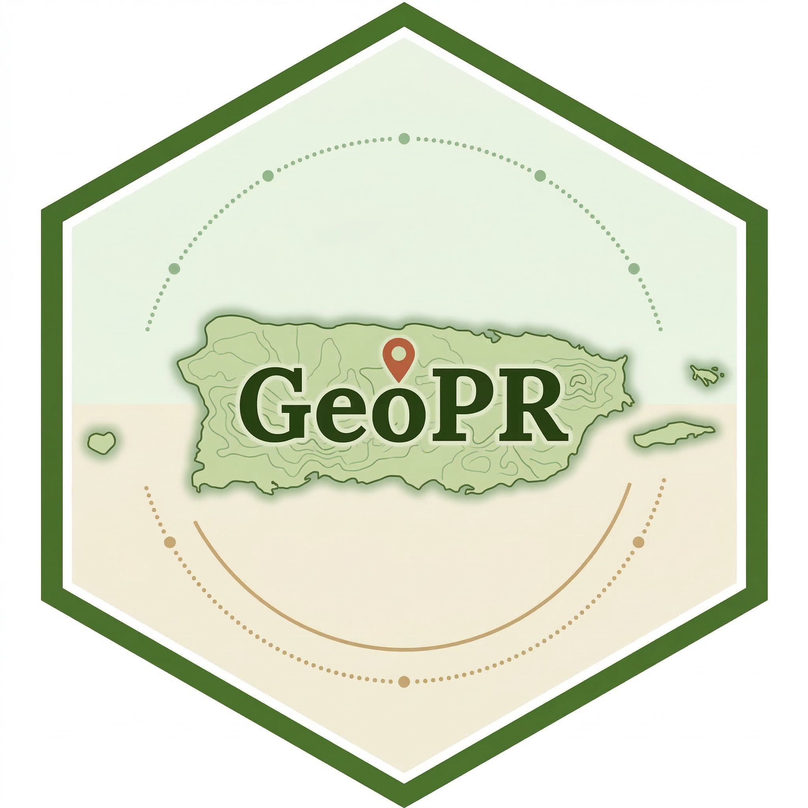

<!-- README.md is generated from README.Rmd. Please edit that file -->

# geopr 

<!-- badges: start -->

[](https://lifecycle.r-lib.org/articles/stages.html#experimental)
[](https://github.com/lanselottwoliveras/geopr/actions/workflows/R-CMD-check.yaml)
<!-- badges: end -->

**geopr** provides a simple and reliable R interface for accessing
official geospatial data from the Puerto Rico government GeoServer
through its WFS (Web Feature Service) endpoint.

With geopr you can:

- **Discover** all geospatial layers published by the Puerto Rico
  GeoServer.
- **Download** layers directly into R as `sf` objects, ready for
  analysis and mapping.
- **Preview** any layer interactively before committing to a full
  download.
- **Save** layers to disk in multiple geospatial formats (GeoPackage,
  GeoJSON, Shapefile, and more).
- Work with layers using **stable numeric IDs or layer names**, without
  manually constructing WFS queries.

The package is designed for researchers, analysts, and practitioners
working with geographic, demographic, environmental, and planning data
from Puerto Rico. geopr abstracts away the technical complexity of WFS
requests while preserving transparency and flexibility for advanced
users.

> **Note:** This package is currently experimental. The API may change.
> See [Experimental status](#experimental-status) for details.

------------------------------------------------------------------------

## Installation

Install the development version from
[GitHub](https://github.com/lanselottwoliveras/geopr):

``` r
# install.packages("remotes")
remotes::install_github("lanselottwoliveras/geopr", dependencies = TRUE)
```

------------------------------------------------------------------------

## Functions overview

| Function              | Description                             |
|-----------------------|-----------------------------------------|
| `geopr_list_layers()` | List all available layers with metadata |
| `geopr_get_layer()`   | Download a layer as an `sf` object      |
| `geopr_preview()`     | Interactive map preview of a layer      |
| `geopr_save()`        | Save an `sf` object to disk             |

------------------------------------------------------------------------

## Usage

### 1. List available layers

``` r
library(geopr)

layers <- geopr_list_layers()
print(layers)
```

Returns a tidy `tibble` with one row per layer:

| Column     | Description                                    |
|------------|------------------------------------------------|
| `layer_id` | Stable numeric identifier assigned by geopr    |
| `layer`    | Short layer name (without namespace)           |
| `grupo`    | Layer group code (e.g. `"g03"`)                |
| `tema`     | Primary theme extracted from the layer name    |
| `subtema`  | Secondary theme (when present)                 |
| `year`     | Year embedded in the layer name (when present) |

``` r
# Search layers by keyword
layers |>
  dplyr::filter(grepl("municipio", layer, ignore.case = TRUE))

# Browse layers from a specific group
layers |>
  dplyr::filter(grupo == "g03")
```

------------------------------------------------------------------------

### 2. Download a layer

Layers can be downloaded by **layer name** or **numeric `layer_id`**.

``` r
# By short layer name
municipios <- geopr_get_layer("g03_legales_municipios_2023")

# By numeric layer_id (from geopr_list_layers())
municipios <- geopr_get_layer(1)

print(municipios)
```

All layers are returned as `sf` objects with their original CRS.

#### Download options

``` r
# Reproject on download
municipios <- geopr_get_layer("g03_legales_municipios_2023", crs = 32161)

# Filter spatially with a bounding box
municipios <- geopr_get_layer(
  "g03_legales_municipios_2023",
  bbox = c(-67.3, 17.9, -65.2, 18.6)
)

# Filter by attribute using CQL
barrios_sj <- geopr_get_layer(
  "g03_barrios",
  cql_filter = "municipio = 'San Juan'"
)
```

#### Download a full layer (automatic pagination)

Some layers contain more features than the default WFS page size
(5,000). Use `all = TRUE` to automatically paginate through all pages:

``` r
municipios <- geopr_get_layer(
  "g03_legales_municipios_2023",
  all = TRUE
)

print(municipios)
```

This guarantees that no features are silently truncated.

------------------------------------------------------------------------

### 3. Preview a layer interactively

`geopr_preview()` downloads a small sample and renders an interactive
map — useful for exploring a layer before a full download.

``` r
# Quick preview by name (downloads 500 features by default)
geopr_preview("g03_municipios")

# Fewer features for faster loading
geopr_preview("g03_municipios", n = 78)

# Preview with a custom color
geopr_preview("g03_municipios", color = "#2A9D8F", alpha = 0.6)

# Preview a pre-downloaded sf object directly
geopr_preview(municipios, layer_name = "PR Municipalities")

# Limit the preview area with bbox
geopr_preview("g03_barrios", bbox = c(-66.2, 18.3, -65.9, 18.5))
```

The function uses `mapview` by default and falls back to `leaflet` if
`mapview` is not installed.

------------------------------------------------------------------------

### 4. Save a layer to disk

``` r
# Save as GeoPackage (default)
geopr_save(municipios, layer_name = "g03_municipios")

# Save as GeoJSON in a specific folder
geopr_save(municipios, layer_name = "g03_municipios",
           format = "geojson", dir = "data/")

# Save as Shapefile with a custom filename
geopr_save(municipios, layer_name = "g03_municipios",
           format = "shp", filename = "municipios_pr")

# Overwrite an existing file
geopr_save(municipios, layer_name = "g03_municipios", overwrite = TRUE)
```

Supported formats: `"gpkg"`, `"geojson"`, `"shp"`, `"fgdb"`, `"csv"`.

------------------------------------------------------------------------

## Data source

geopr accesses data from the official Puerto Rico government GeoServer
WFS endpoint:

> <http://geoserver2.pr.gov/geoserver/pr_geodata/wfs>

All data ownership, maintenance, and publication remain with the
original data providers. geopr does not host, modify, or redistribute
any datasets.

------------------------------------------------------------------------

## Experimental status

geopr is under active development. Expect the following:

- The function API may change in future versions.
- Not all layers have been fully tested.
- Error handling and performance optimizations are ongoing.

Feedback, bug reports, and feature suggestions are welcome via [GitHub
Issues](https://github.com/lanselottwoliveras/geopr/issues).
